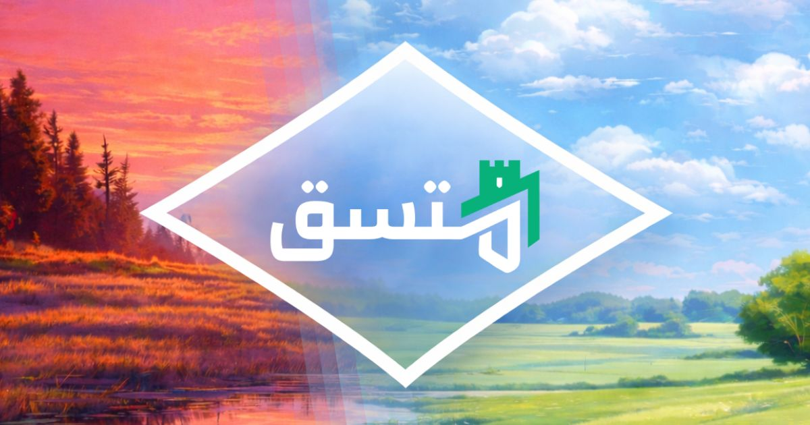

بسم الله الرحمن الرحيم

# مُتَّسِق

تطبيق يهدف للاتساق مع الإسلام لله ربّ العالمين، خطوة بخطوة، وبيُسر وسهولة بإذن الله. تطبيق بترميز واحد لكل المنصات، مصنوع بتقنيات حديثة، ومصمم بواجهة جذابة؛ ولا حول ولا قوة إلا بالله...

أفكار المشروع مستعرَضة عن طريق فيديو في [منشور التليجرام](https://t.me/tiqaniy/29) هذا:  

### المتصفح

لتجربة التطبيق الآن من أي متصفح: 
https://muttasiq.com

  

### الأندرويد

قريبًا، بإذن الله... (الشرح في فيديو التليجرام [في الأعلى](#مُتَّسِق))

&nbsp;&nbsp;

## المهام

لاقتراح أي فكرة أو مناقشة أي خاصيّة حالية للتطبيق، يُرجى طرحها -**لا في قسم [المشكلات التقنية](https://github.com/GoodM4ven/NATIVE_TALL_muttasiq-dot-com/issues)**- بل في قسم [النقاشات](https://github.com/GoodM4ven/NATIVE_TALL_muttasiq-dot-com/discussions)، جزاكم الله خيرا، والسلام.

وهناك [قسم متكامل](https://github.com/users/GoodM4ven/projects/5/views/1) لاستعراض المهمات التقنية قيد العمل، للمختصين، والذي يمكن من خلاله قياس حوية المشروع بشكل عام.

### المحرك
- ~~ترميز واحد لتصدير تطبيق لجميع المنصات~~
- ~~حافظة محليّة لإنجازات وإعدادات المستخدم~~
- ~~اختبارات برمجية لتطبيق الويب (المتصفح)~~
- اختبارات برمجية لتطبيقات المنصات (المحليّة)
- قسم لاستعراض المهام والمتغيّرات بين النسخ
- محرك للغة العربية، بحثًا وتحليلًا
- إخفاء الحركات
- القراءة بالعربية صوتيًّا
- دعم اللغات الأجنبية بشكل مفتوح المصدر

### الانطلاق
- ~~أذكار الصباح والمساء~~

### التحديث الأوّل
- تذكير بأذكار الصباح والمساء
- أذكار يوم الجمعة
- إمكانية تعديل الأذكار وترتيبها

### التحديث الثاني
- الصلوات وتذكيراتها
- قضاء الصلوات أيّام ضلال المرء
- سُنّة الاستهام

### التحديث الثالث
- صِلة
- صحيح الأدعية، مُقسَّمَة بأنواع الاحتياجات

### التحديث الرابع
- القرآن الكريم
- الوِرد اليومي من القرآن الكريم

### التحديث الخامس
- سنن اليوم والليلة
- اصطياد كل السنن بآثارها، ولو مرّة في العمر

### التحديث السادس
- علم الحديث: إسناد ورواة ومتون
- إمكانية جرد الآثار باتساق

## الدعم

كما تعلم، بارك الله فيك، فجعل التطبيق متاحًا على المخدّمات، ومتوفّرًا في كافّة المنصات (بأنواع أجهزتها المختلفة) وبيُسر وسهولة، يحتاج إلى طاقة ومال وفيرين! وتطوير كل هذه الإمكانيات يأخذ تخطيطا بوقت كثير وبذل جهد كبير، وعلى حساب أيّ عمل أو صنعة أخرى... فلا تنسانا من الدعاء.

وكذلك تستطيع دعم تطوير وصيانة المشروع هذا عن طريق الاشتراك ([بمبلغ شهري](https://github.com/sponsors/GoodM4ven))، أو عن طريق التبرّع [لمرّة واحدة](https://github.com/sponsors/GoodM4ven?frequency=one-time&sponsor=GoodM4ven)، وذلك في المنصات التالية:

- [جيتهاب | Github](https://github.com/sponsors/GoodM4ven)
- [باتريون | Patreon](https://patreon.com/GoodM4ven)
- [باي مي كوفي | BuyMeCoffee](https://buymeacoffee.com/goodm4ven)

وإن كنت مطوّرًا أو مصمّمًا، وتودّ دعم هذا المشروع، فقم بِتَفَقُّد القسم المخصص في الأسفل.

والله المستعان.

### الداعمون

- [قناة الرقية الشرعية](https://t.me/Ruqyah011) (لأبي عمر، يوسف)
- [هيثم عسولي](https://github.com/haithamassoli)

 

# Development

**The web app** is built using one of the most standard and well-documented web technology stacks, known as the [TALL stack](https://tallstack.dev). Get a grip over the general concepts in the docs as soon as possible - after considering the tip below:
- [https://tailwindcss.com/docs](https://tailwindcss.com/docs)
- [https://alpinejs.dev/docs](https://alpinejs.dev/docs)
- [https://livewire.laravel.com/docs](https://livewire.laravel.com/docs)
- [https://laravel.com/docs](https://laravel.com/docs)
- [https://filamentphp.com/docs](https://filamentphp.com/docs)
- [https://pestphp.com/docs](https://pestphp.com/docs)

**The native apps**, are built using [NativePHP](https://nativephp.com). And with their new mobile builder, all platforms are covered. It relies on a wide ecosystem of technologies — without requiring YOU to directly interact with them.
- Check out their [desktop](https://nativephp.com/docs/desktop) AND [mobile](https://nativephp.com/docs/mobile) documentation please.
- If you have experience with [Kotlin](https://kotlinlang.org/) or [Swift](https://www.swift.org/), [electronJS](https://www.electronjs.org/) is communicating with them under the hood in NativePHP. You can implement those changes as PHP [plugins](https://nativephp.com/plugins) of course, and even make them paid to support yourself!

> [!TIP]
> You can also start learning about ALL of these technologies by using [Laravel Boost](https://laravel.com/docs/boost), which does almost everything for you if you give the AI agent well-engineered commands — including writing feature tests. I set it up in this project with the [Codex CLI](https://developers.openai.com/codex/cli/), but it can work with pretty much anything.

## Coding

### Rules

0. Focus on the main [missions](#المهام) detailed in [discussions](https://github.com/GoodM4ven/NATIVE_TALL_muttasiq-dot-com/discussions) and assigned in the [project](https://github.com/users/GoodM4ven/projects/5/views/1) view. So unless it's a bug fix, **do not work on any new feature without having an [issue](https://github.com/GoodM4ven/NATIVE_TALL_muttasiq-dot-com/issues) and being assigned to**.
1. Use and maintain the 3 root-directory ([`native-dev`](./native-dev.sh), [`native-run`](./native-run.sh), and [`native-watch`](./native-watch.sh)) bash scripts to run and watch the web app, run the native app, and run and watch the native app respectively.
2. Since any change to the `main` branch is going to **directly update the web app**, **PRs are NOT going to be directed to `main` branch, please, but rather to `dev` branch instead.**
3. Use the `composer green` command before you do the PR in the first place. It will do the standard code formatting, linting, and testing altogether.
4. Ensure the [Python](https://python.org) patching [scripts](https://github.com/GoodM4ven/NATIVE_TALL_muttasiq-dot-com/tree/main/.scripts/native/patches) that override the original NativePHP package **do not conflict with one another and correctly patch the files of the NativePHP version specified in [`composer.json`](./composer.json)**.

### Tools and Guides

- Setting up your **development environment** could be easier using this [lara-stacker](https://github.com/GoodM4ven/CLI_LARAVEL_lara-stacker) CLI scripts, which utilizes [Docker](https://docker.com) to setup the main services, and leaving you to only care about few tools that are essential for [PHP](https://php.net) development.
- For reproducing the [favicon](./resources/views/partials/favicon.blade.php) variences, use this [favycon](https://github.com/ruisaraiva19/favycon) tool.
- [TALL-STANDARDS](https://github.com/GoodM4ven/WIKI_WEB_tall-standards) wikipedia contains a decent bit of tips for dealing with the tall-stack and some other related tools and technologies. (The project isn't complete)

## Design

If you're a designer, or perhaps you don't know much about coding, feel free to post in [discussions](https://github.com/GoodM4ven/NATIVE_TALL_muttasiq-dot-com/discussions) any contributions to how you think visuals can be improved; supported by photos and videos, of course.

- The icon is set to be a 1024x1024 pixels PNG:

  

   

- As for the splash screen, it has to be a portrait 1080x1920 pixels PNG:

  

  

  > [!NOTE]
  > There is light and dark themed splash screen feature, but I'm not currently utilizing it because of the current poor brand anyway...

- As for the meta OpenGraph image, it should be a 1200x630 pixels JPG:

  

   

The assets used for the app so far can be found in this online [Penpot](https://design.penpot.app/#/workspace?team-id=82e31d90-3829-8139-8002-c1de54898224&file-id=ff5222bd-026b-80fd-8007-8c6597adff77&page-id=71bc4f81-468d-8163-8007-8a43ee7cd755) draft (request needed), **which you preview quickly from [here](https://design.penpot.app/#/view?file-id=ff5222bd-026b-80fd-8007-8c6597adff77&page-id=71bc4f81-468d-8163-8007-8a43ee7cd755&section=interactions&frame-id=987eaac6-303b-803f-8007-8ce38438e2c9&index=0&share-id=57e6ab48-ab48-8193-8007-8ce21800cfa5)** or edit it freely using this [[design.penpot](./.assets/design.penpot)] file.

## Resources

- [https://heropatterns.com](https://heropatterns.com)
- [https://blade-ui-kit.com/blade-icons](https://blade-ui-kit.com/blade-icons)
- [https://laravel-package-ocean.com](https://laravel-package-ocean.com)
- [https://filamentphp.com/plugins](https://filamentphp.com/plugins)
- [https://nativephp.com/plugins](https://nativephp.com/plugins)

## Credits

### Contributors

- [GoodM4ven](https://github.com/GoodM4ven) (أبو عبد الله الحاسوبي)
- [M4MD24](https://github.com/M4MD24) (أبو عثمان الهواري)
- Telegram Supporters: [@yahya_0beid](https://t.me/yahya_0beid) (يحيى العبيدي), [@Al_Fawzawi](https://t.me/Al_Fawzawi) (أبو عوف الفوزوي), [@Selamah_Aldimashqq](https://t.me/Selamah_Aldimashqq) (سلمة الدمشقي) 

### Assets

احذر 
ذوات 
الأرواح

- [Morning athkar background](https://www.freepik.com/free-ai-image/beautiful-anime-landscape-cartoon-scene_94944933.htm#fromView=search&page=3&position=17&uuid=7fbc119d-abf3-4f15-b3b3-7073afb85ff8&query=Anime+nature+wallpaper+day)
- [Night athkar background](https://www.freepik.com/free-ai-image/digital-art-isolated-house_93658018.htm#fromView=search&page=1&position=36&uuid=7fbc119d-abf3-4f15-b3b3-7073afb85ff8&query=Anime+nature+wallpaper+day) (modified via ChatGPT)

### Technologies
- [ChatGPT](https://chatgpt.com) and [Codex CLI](https://developers.openai.com/codex/cli/)
- [Laravel](https://laravel.com) entire ecosystem
- [TALL-Stack](https://tallstack.dev)
- [FilamentPHP](https://filamentphp.com)
- [NativePHP](https://nativephp.com)
- [VSCodium](https://vscodium.com) (the project was removed and then recovered, file by file, using tons of versions for each file from **the no-telemetry cache**)

 

والحمد لله ربّ العالمين

