
بسم الله الرحمن الرحيم

# مُتَّسِق

منصة تهدف للاتساق مع الإسلام لله ربّ العالمين، خطوة بخطوة، وبيُسر وسهولة بإذن الله. تطبيقات بترميز واحد لكل المنصات، مصنوعة بتقنيات حديثة، ومصممة بواجهة جذابة؛ ولا حول ولا قوة إلا بالله...

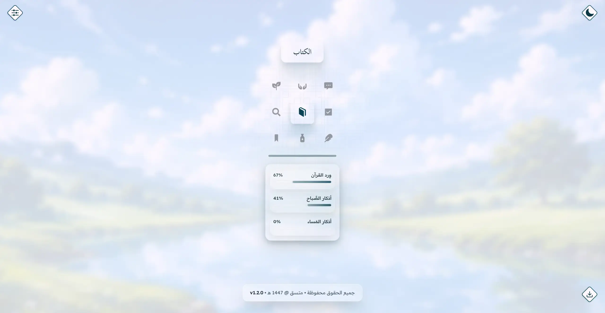

### المتصفح

لتجربة التطبيق الآن من أي متصفح، على أي جهاز: 
https://muttasiq.com

 

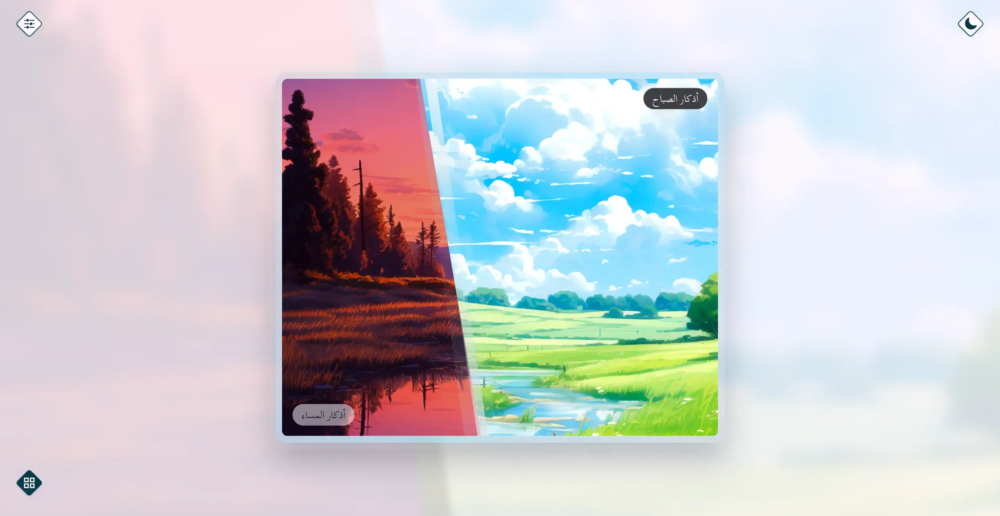
  
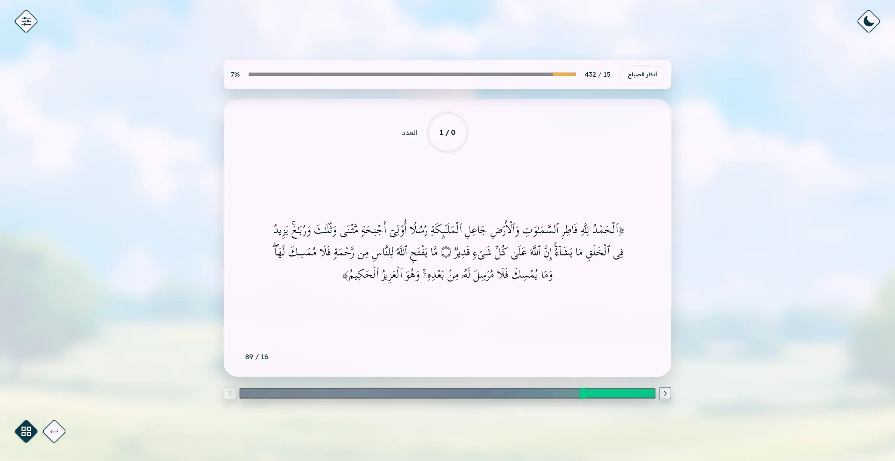
  
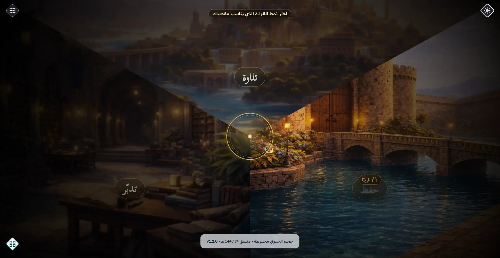
  
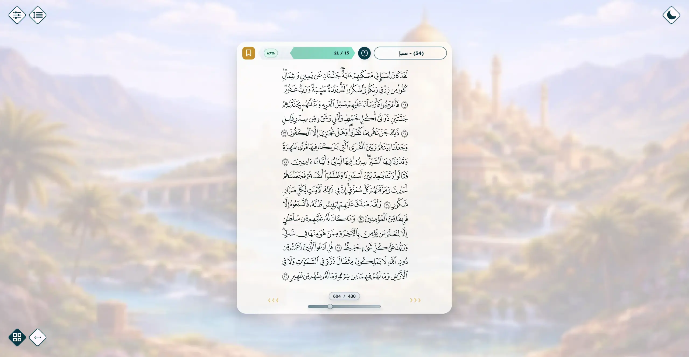

### الأندرويد

يمكن تحميل التطبيق من متجر بلاي الرسميّ:

 

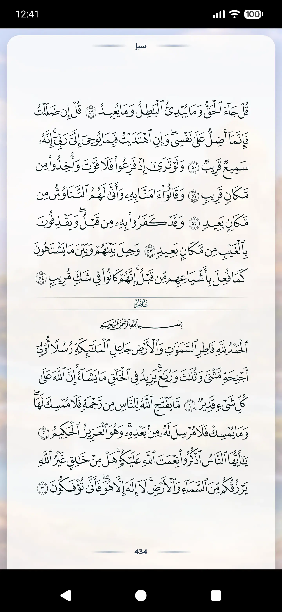
&nbsp;&nbsp;
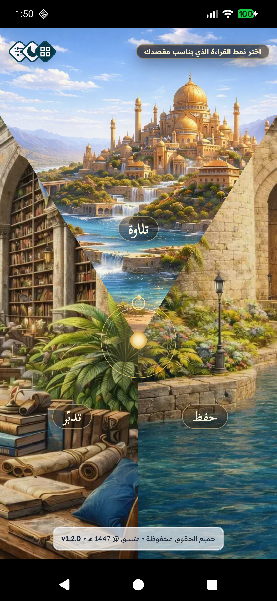
&nbsp;&nbsp;

&nbsp;&nbsp;

### الآي أو اس

يمكن تحميلي التطيبق من متجر آب ستور الرسميّ، بمجرّد اعتماده من قبل آبل:

 

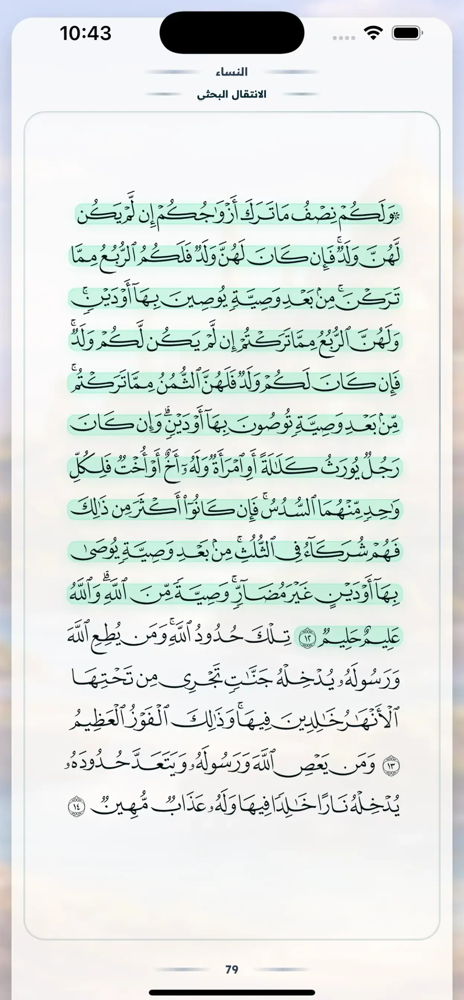
&nbsp;&nbsp;
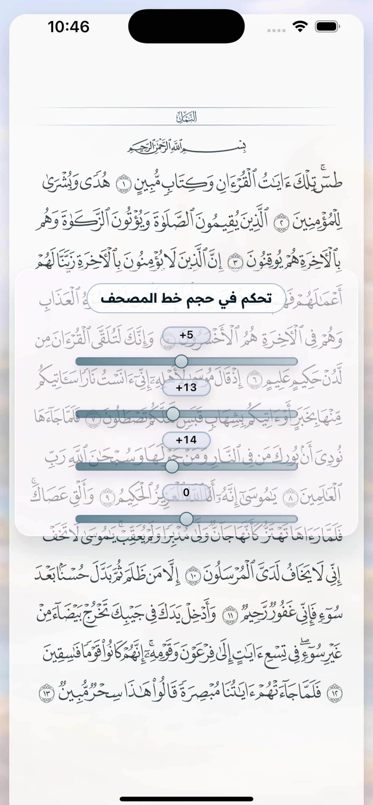
&nbsp;&nbsp;
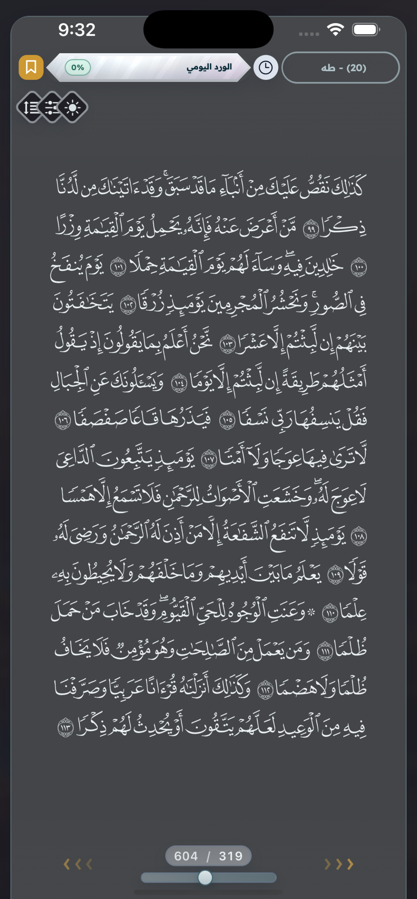
&nbsp;&nbsp;
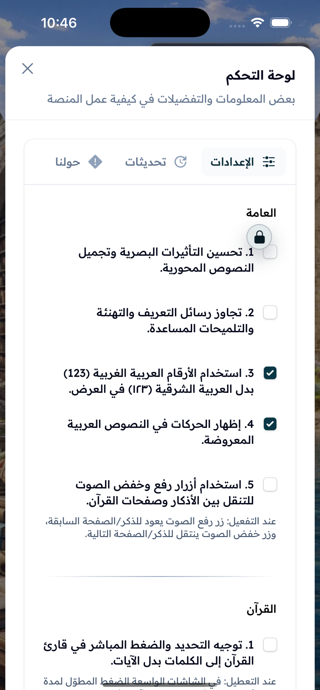

## المهام

لاقتراح أي فكرة أو مناقشة أي خاصيّة حالية للتطبيق، يُرجى طرحها -**لا في قسم [المشكلات التقنية](https://github.com/GoodM4ven/NATIVE_TALL_muttasiq-dot-com/issues)**- بل في قسم [النقاشات](https://github.com/GoodM4ven/NATIVE_TALL_muttasiq-dot-com/discussions)، جزاكم الله خيرا، والسلام.

وهناك [قسم متكامل](https://github.com/users/GoodM4ven/projects/5/views/1) لاستعراض المهمات التقنية قيد العمل، للمختصين، والذي يمكن من خلاله قياس حوية المشروع بشكل عام.

### المحرك
- ~~ترميز واحد لتصدير تطبيق لجميع المنصات~~
- ~~حافظة محليّة لإنجازات وإعدادات المستخدم~~
- ~~اختبارات برمجية لتطبيق الويب (المتصفح)~~
- اختبارات برمجية لتطبيقات المنصات (المحليّة)
- ~~قسم لاستعراض المهام اليومية للمسلم المتسق~~
- ~~قسم لاستعراض التطوير والمتغيّرات بين النسخ~~
- قسم لاستعراض وشرح الخواص الحالية في التطبيق
- ~~محرك للغة العربية، بحثًا وتحليلًا~~
- ~~إخفاء الحركات~~
- ~~نظام أرقام شرقيّ وغربيّ~~
- ~~إتاحة نموذج لإرسال المشاكل مباشرة من التطبيق~~
- القراءة بالعربية صوتيًّا
- دعم اللغات الأجنبية بشكل مفتوح المصدر

### الأذكار
- ~~أذكار الصباح والمساء~~
- ~~إمكانية تعديل الأذكار وترتيبها~~
- ~~السماح باقتراح تعديل للأذكار الأساسية~~
- ~~إمكانيّة نسخ الأذكار عند الضغط المطوّل عليها~~
- ~~(الجوال) القدرة على التنقل بين الأذكار عن طريق أزرار صوت الجهاز~~

### الكتاب
- ~~نمط للقراءة اليسيرة للقرآن الكريم~~
- ~~نسخ الآيات بسهولة وبالرسم العثماني~~
- ~~البحث الشامل واللغوي في القرآن الكريم~~
- ~~متابعة الوِرد اليومي من القرآن الكريم~~
- ~~(الجوال) القدرة على التنقل بين صفحات المصحف عن طريق أزرار صوت الجهاز~~

### تحديثات قادمة (في حالة دعم المشروع إن شاء الله)
- التاريخ الهجري
- الصلوات وتذكيراتها
- قضاء الصلوات أيّام ضلال المرء
- تذكير بأذكار الصباح والمساء
- أذكار يوم الجمعة
- نمط الأذكار المطلق
- تذكير بالورد اليومي للقرآن
- صِلة، لصلة الأرحام
- سُنّة الاستهام
- سنن اليوم والليلة
- اصطياد كل السنن بآثارها، ولو مرّة في العمر
- صحيح الأدعية، مُقسَّمَة بأنواع الاحتياجات
- أسماء الله الحسنى
- علم الحديث: إسناد ورواة ومتون
- إمكانية جرد الآثار باتساق
- (والمزيد، إن شاء الله...)

## الدعم

كما تعلم، بارك الله فيك، فجعل المنصّة متاحًةً على المخدّمات، ومتوفّرةً في كافّة المنصات (بأنواع أجهزتها المختلفة) وبيُسر وسهولة، يحتاج إلى طاقة ومال وفيرين! وتطوير كل هذه الإمكانيات يأخذ تخطيطا بوقت كثير وبذل جهد كبير، وعلى حساب أيّ عمل أو صنعة أخرى... فلا تنسانا من الدعاء.

وكذلك تستطيع دعم تطوير وصيانة المشروع هذا عن طريق الاشتراك ([بمبلغ شهري](https://github.com/sponsors/GoodM4ven))، أو عن طريق التبرّع [لمرّة واحدة](https://github.com/sponsors/GoodM4ven?frequency=one-time&sponsor=GoodM4ven)، وذلك في المنصات التالية:

<table>
  <tr>
    <td align="center">
      <a href="https://github.com/sponsors/GoodM4ven">
        <strong>جيتهاب | Github</strong>
      </a>
    </td>
  </tr>
  <tr>
    <td align="center">
      
    </td>
  </tr>
</table>

<table>
  <tr>
    <td align="center">
      <a href="https://patreon.com/GoodM4ven">
        <strong>باتريون | Patreon</strong>
      </a>
    </td>
  </tr>
  <tr>
    <td align="center">
      
    </td>
  </tr>
</table>

<table>
  <tr>
    <td align="center">
      <a href="https://buymeacoffee.com/goodm4ven">
        <strong>باي مي كوفي | BuyMeCoffee</strong>
      </a>
    </td>
  </tr>
  <tr>
    <td align="center">
      
    </td>
  </tr>
</table>

وإن كنت مطوّرًا أو مصمّمًا، وتودّ دعم هذا المشروع، فقم بِتَفَقُّد القسم المخصص في الأسفل.

والله المستعان.

# Development

**The web app** is built using one of the most standard and well-documented web technology stacks, known as the TALL stack (TailwindCSS, AlpineJS, Livewire and Laravel). Get a grip over the general concepts in the docs as soon as possible - after considering the tip below:
- [https://tailwindcss.com/docs](https://tailwindcss.com/docs)
- [https://alpinejs.dev/docs](https://alpinejs.dev/docs)
- [https://livewire.laravel.com/docs](https://livewire.laravel.com/docs)
- [https://laravel.com/docs](https://laravel.com/docs)
- [https://filamentphp.com/docs](https://filamentphp.com/docs)
- [https://pestphp.com/docs](https://pestphp.com/docs)

**The native apps**, are built using [NativePHP](https://nativephp.com). And with their new mobile builder, all platforms are covered! It relies on a wide ecosystem of technologies — without requiring YOU to directly interact with them, all.
- Check out their [desktop](https://nativephp.com/docs/desktop) AND [mobile](https://nativephp.com/docs/mobile) documentation if you're interested in contributing for that.
- If you have experience with [Kotlin](https://kotlinlang.org) or [Swift](https://www.swift.org), [ElectronJS](https://www.electronjs.org) is communicating with them under the hood in NativePHP and onwards into PHP "bridges." Eventually implemented modifications are available as PHP [plugins](https://nativephp.com/plugins), and there are even lots of those already available to pay for!

> [!TIP]
> You can also start learning about ALL of these technologies by using [Laravel Boost](https://laravel.com/docs/boost), which does almost everything for you if you give the AI agent well-engineered commands — including writing feature tests. I set it up in this project for [OpenAI - Codex CLI](https://developers.openai.com/codex/cli/) and [Anthropic - Claude CLI](https://code.claude.com/docs), but it can work with pretty much anything else...

## Coding

### Rules

0. Focus on the main [missions](#المهام) detailed in [discussions](https://github.com/GoodM4ven/NATIVE_TALL_muttasiq-dot-com/discussions) and assigned in the [project](https://github.com/users/GoodM4ven/projects/5/views/1) view. So unless it's a bug fix, **do not work on any new feature without having an approved [issue](https://github.com/GoodM4ven/NATIVE_TALL_muttasiq-dot-com/issues) for it first and being assigned to second**.
1. Use and maintain the bash scripts found in [./.scripts] directory, providing utilities to run, watch and log all available platform applications, and more...
2. Since any change to the `main` branch is going to **directly update the web app**, **PRs are NOT going to be directed to `main` branch, please, but rather to `dev` branch instead.**
3. Use the `composer green` command before you do the PR in the first place. It will do the standard code formatting, linting, and testing altogether. Please trace what it does in [composer.json](./composer.json).
   - The process runs [PestPHP browser tests](https://pestphp.com/docs/browser-testing) in `--compact` mode only (not `--parallel`) due to current bugs in the [Playwright](https://playwright.dev) and PestPHP integration, including direct mobile emulation support, which **may make tests slower locally**, though they work reliably (this limitation does not apply to CI, I think, since it’s ephemeral).
4. We have [`muttasiq-patches` NativePHP plugin](https://github.com/GoodM4ven/NATIVE_PLUGIN_muttasiq-patches) that overrides the original NativePHP engine a bit, and add new native features, of course. Make sure you account for what it does in mind, where (the PR you're going to do there) its modifications **do not conflict with one another when patching the same file and correctly patch the files they're targetting from the NativePHP version specified in [`composer.json`](./composer.json)** over here.
    - Keep in mind that there is a Bash switching script for when you have the package locally and test its changes locally before the PR. [Check it out](./.scripts/composer-local-plugins-switch.sh).
    - Quran data is delivered via the web API snapshot flow (`/api/quran-snapshot/meta` + `/api/quran-snapshot/download`) with in-app progress reporting. [`watch-android.sh`](./.scripts/watch-android.sh) serves these from the existing lara-stacker Docker app over a single Tailscale Funnel ([`run-android-docker-funnel.sh`](./.scripts/support/run-android-docker-funnel.sh)); [`watch-ios.sh`](./.scripts/watch-ios.sh) still uses the local-server broadcast path ([`run-native-local-source-broadcast.sh`](./.scripts/support/run-native-local-source-broadcast.sh), WiFi/reverse-adb). See [Running Locally](#running-locally) for the funnel setup.
5. **Ensure that your PR can be modified by the maintainers please.**

### Setup

1. Clone into the apps-root directory of [lara-stacker](https://github.com/GoodM4ven/CLI_MACOS_lara-stacker) and run its "Rewire" command on this project; that repository's README covers the environment itself. Any setup that provides the runtimes pinned in [`mise.toml`](./mise.toml) plus MySQL and Redis works too — the app is not tied to lara-stacker.
2. The host toolchain is pinned with [mise](https://mise.jdx.dev): `mise install` provides PHP, Node, and pnpm and puts `vendor/bin` and `node_modules/.bin` on `PATH`, so `pint`, `pest`, `phpstan`, and `prettier` run without a prefix. `mise tasks ls` lists the [`./.scripts`](./.scripts) wrappers; everything else is a Composer script (`composer run --list`).
   - This project uses **pnpm**, not npm — a `preinstall` hook enforces it.
   - `.env` is deliberately **not** loaded by mise. Exporting it would override the `<env>` entries in [`phpunit.xml`](./phpunit.xml), because PHPUnit skips those when a variable is already set, and the suite would then run against the development database. See the comments in [`mise.toml`](./mise.toml).
3. Run `composer setup`, as for any Laravel project.
4. **Native builds need platform SDKs that mise does not manage.** Android needs [Android Studio](https://developer.android.com/studio) for the SDK (`adb`) **and its bundled JDK** — Gradle will not run without a JDK on `PATH` or a valid `JAVA_HOME`. iOS needs Xcode for `xcrun`/`xcodebuild`.
5. Editor: [Zed](https://zed.dev). Install its PHP extension once (`cmd-shift-x`) to supply the `Xdebug` adapter that [`.zed/debug.json`](./.zed/debug.json) expects, then pick your own shortcut for `debugger: start`.
6. And whatever we advised to do for quick learning about this stack, please make sure you read the [development section](#development) up top.
7. For [Laravel Boost](https://laravel.com/docs/boost) installation, first, **if it doesn't exist already**, `cp boost.json.dist boost.json` and modify if necessary, then call `php artisan boost:install` to guide you in terminal.

### Scripts

- Use `composer dev` to run the local web stack together — it starts the web server, **the queue worker** (`php artisan queue:listen`), **Reverb** (`php artisan reverb:start`), the log tailer, and Vite. Queue + Reverb are now hard dependencies for authenticated account/settings synchronization and realtime cross-device invalidation, so if you start the app without `composer dev`, also run a queue worker and Reverb yourself.
- When testing native server/sync/realtime behavior, run the matching native watch script (`.scripts/watch-android.sh` or `.scripts/watch-ios.sh`) and pass the resulting endpoints into the native build. Use plain `composer dev` only when you want the web stack.
- **Android** (`.scripts/watch-android.sh` → [`run-android-docker-funnel.sh`](./.scripts/support/run-android-docker-funnel.sh)) reuses the **existing lara-stacker Docker app** (`https://muttasiq.dev.localhost`) instead of spinning up a second `php artisan serve`. It exposes that app over a **single Tailscale Funnel on `:443`**, and the app's Reverb websocket rides the **same `:443`** (Caddy proxies `/app` to the host Reverb). One port-less domain is required because Telegram's login-widget domain in BotFather is host-only and rejects ports. iOS still uses the older [`run-native-local-source-broadcast.sh`](./.scripts/support/run-native-local-source-broadcast.sh) local-server path.
  - The Funnel runs in lara-stacker's Tailscale container and targets Caddy's dedicated internal `:8081` funnel site. Nothing Tailscale-related belongs in this project's `.env`.
  - **Set the BotFather login-widget domain to the Funnel FQDN printed by the watch script.** It derives from lara-stacker's Tailscale container name, so it changes whenever you switch machines, and Telegram login keeps failing until the widget domain matches.
- Local Reverb keeps only `REVERB_APP_ID`, `REVERB_APP_KEY`, and `REVERB_APP_SECRET` in the project env. The app derives its public web endpoint from `APP_URL`; lara-stacker supplies the container-to-host server route, and the native watch scripts supply their Funnel endpoint at build time.

#### What `watch-android.sh` orchestrates

| # | Thing | Where it runs | Port / URL | Notes |
|---|-------|---------------|------------|-------|
| 1 | muttasiq web+API app (`php-fpm`) | lara-stacker Docker (`app` + `caddy`) | `:443` via funnel FQDN | Reused, **not** re-served — serves `/api/settings`, `/api/quran-snapshot/*`, `/auth/telegram/native` |
| 2 | Reverb websocket | host (`php artisan reverb:start`) | host `:8080`, client via `wss://<fqdn>/app` | Caddy proxies `/app` → `host.docker.internal:8080`; rides the same `:443` funnel |
| 3 | Tailscale Funnel | lara-stacker `tailscale` container | public `:443` → Caddy `:8081` | The script discovers the running Compose service and confirms the public HTTP + websocket routes before building |
| 4 | Android native build + watcher | host (`native:run android --watch`) | on-device | Gets funnel endpoints + `VITE_REVERB_*` pointed at `<fqdn>:443` (https) |

Provided by **lara-stacker's** Docker stack (already running, not started by the script): `caddy`, `tailscale`, `app` (php-fpm), `mysql`, `redis`, `mailpit`, `minio`, plus the file `synchronizer`. The script starts Reverb when needed, confirms the existing Funnel route, then starts the native watcher.
- The native runtime automatically uses persistent file-backed cache and sessions on both platforms, while its on-device queue stays database-backed. This keeps lara-stacker's Redis settings web-only because the embedded mobile PHP runtime does not ship with the Redis extension.

### Tools and Guides

- For reproducing the [favicon](./resources/views/partials/favicon.blade.php) variences, use this [favycon](https://github.com/ruisaraiva19/favycon) tool.
- For responsive design, we recommend using [Polypane](https://polypane.app) amazing design software.

## Design

If you're a designer, or perhaps you don't know much about coding, feel free to post in [discussions](https://github.com/GoodM4ven/NATIVE_TALL_muttasiq-dot-com/discussions) any contributions to how you think visuals can be improved; supported by photos and videos, of course...

- The icon is set to be a 1024x1024 pixels PNG:

  

   

- As for the splash screen, it has to be a portrait 1080x1920 pixels PNG:

  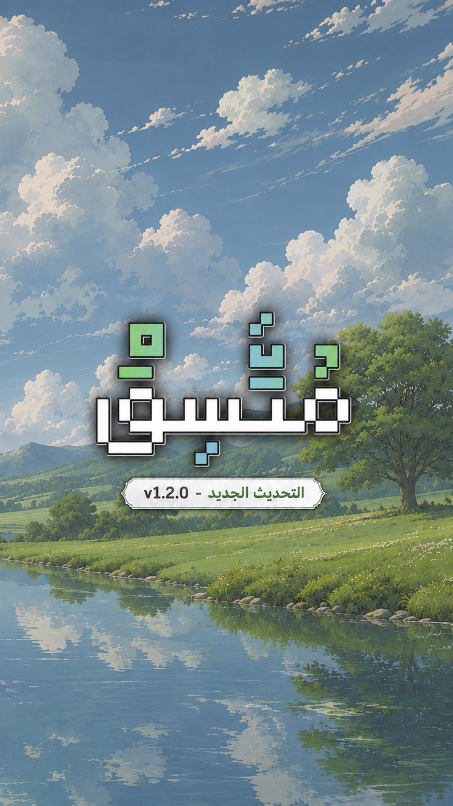

  

  > [!NOTE]
  > There is light and dark themed splash screen feature, but I'm not currently utilizing it because of the lack of designers around; so looking for help...!

- As for the meta OpenGraph image, it should be a 1200x630 pixels JPG:

  

   

The assets used for the app so far can be found in this over [here](https://design.penpot.app/#/view?file-id=ff5222bd-026b-80fd-8007-8c6597adff77&page-id=71bc4f81-468d-8163-8007-8a43ee7cd755&section=interactions&index=0&share-id=e7a86fff-661d-81c1-8008-1028011d91a3)** or edit it freely using this [[design.penpot](./.assets/design.penpot)] file. (Both will be up-to-date soon, in sha'a Allah)

## Resources

- [Uiverse](https://uiverse.io)
- [CodePen](https://codepen.io/trending)
- [FreeFrontend](https://freefrontend.com)
- [Awwwards](https://www.awwwards.com)
- [LDRS](https://uiball.com/ldrs/)
- [https://heropatterns.com](https://heropatterns.com)
- [https://blade-ui-kit.com/blade-icons](https://blade-ui-kit.com/blade-icons)
- [https://laravel-package-ocean.com](https://laravel-package-ocean.com)
- [https://filamentphp.com/plugins](https://filamentphp.com/plugins)
- [https://nativephp.com/plugins](https://nativephp.com/plugins)

## License

This project is licensed under the GNU Affero General Public License v3.0 (AGPL-3.0).

You may redistribute and/or modify this program under the terms of the AGPL v3.
See the full license text in [`LICENSE`](./LICENSE).

Copyright (C) 2026 Muttasiq Contributors.

## Credits

### Assets

احذر 
ذوات 
الأرواح

- [Morning athkar background](https://www.freepik.com/free-ai-image/beautiful-anime-landscape-cartoon-scene_94944933.htm#fromView=search&page=3&position=17&uuid=7fbc119d-abf3-4f15-b3b3-7073afb85ff8&query=Anime+nature+wallpaper+day)
- [Night athkar background](https://www.freepik.com/free-ai-image/digital-art-isolated-house_93658018.htm#fromView=search&page=1&position=36&uuid=7fbc119d-abf3-4f15-b3b3-7073afb85ff8&query=Anime+nature+wallpaper+day) (modified via ChatGPT)

### Technologies
- [ChatGPT](https://chatgpt.com) and [Codex CLI](https://developers.openai.com/codex/cli/)
- [Anthropic Claude](https://code.claude.com/)
- [Laravel](https://laravel.com) entire ecosystem
- [FilamentPHP](https://filamentphp.com)
- [NativePHP](https://nativephp.com)
- [mise](https://mise.jdx.dev) and [verzly/mise-php](https://github.com/verzly/mise-php)
- [OrbStack](https://orbstack.dev) and [Caddy](https://caddyserver.com)
- [Zed](https://zed.dev)
- [VSCodium](https://vscodium.com) (the project was accidentally deleted during development, and then got recovered, file by file, using tons of versions for each file, from **the no-telemetry cache** of this awesome piece of software)

 

والحمد لله ربّ العالمين

